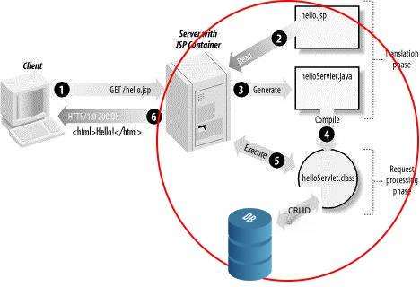

# Webprogrammering frontend

[Admin info om ugen](admin.md)

### Ugens resultat

Efter denne uge har I været igennem følgende: 

1. Introduktion til UX/UI og mockups
2. Generering af dynamiske HTML sider med JSP
2. JSP basiselementer, herunder scriptlet kode, jstl og expression language
3. Servlet-JSP og flerlagsarkitektur

### Oversigt over ugen:  

| Dag     | Emne                                  |
| ------- | ------------------------------------- |
| Mandag  | Feedback fra sidste uge og forberedelse til tirsdag |
| Tirsdag | Undervisning                          |
| Onsdag  |                           |
| Torsdag | Undervisning             |
| Fredag  | Opgave / Cupcake projekt               |

## Frontend betyder det der sendes til browseren

HTML sider bliver genereret på Tomcat webserveren ved hjælp af JSP filer.    
JSP er en template engine der erstatter brugen af servletter til at danne HTML til brugeren. Med JSP får vi en Java fil (under overfladen en servlet), som vi kan skrive i, som om vi skrev HTML med noget indlejret Java. På Tomcat omdannes JSP koden til HTML, som  bliver sendt via internettet til brugerens browser.  
Browseren indlæser HTML siden og renderer et visuelt billede til brugeren (Det vi kalder en webside/web page).

### Øvelse

[BMI opgave](bmi.md)

### Cupcake projekt (sættes i gang onsdag)

Her kan du læse [projektbeskrivelsen](cupcake/cupcake.md).

### Oversigt over ressourcer:  

| Emne    |Kort version| Lang version   |
| ----------------- | ------------ | -------- |
| 1. HTML |[HTML template](htmltemplate.md)| [HTML Quick guide](https://www.nobledesktop.com/html-quick-guide)  |  
| 2. JSP |[JSP basic](jsp.md)| [Dynamiske sider med JSP](https://www.tutorialspoint.com/jsp/index.htm) |
| 3. JSP |[Standard Tag Library (JSTL Core Tags)](https://www.tutorialspoint.com/jsp/jsp_standard_tag_library.htm)| [JSTL core](https://docs.oracle.com/cd/E19159-01/819-3669/bnakc/index.html) |
| 4. MVC pattern | [Pattern for struktur i præsentationslag](mvc.md) | |
| 5. JUnit test | [JUnit Cookbook](https://junit.org/junit4/cookbook.html)|[JUnit Developer Guide](https://www.javaguides.net/p/junit-4.html) |
|6. Test case teknikker |[Boundary Value Analysis & Equivalence Partitioning](https://www.guru99.com/equivalence-partitioning-boundary-value-analysis.html) |
| Adober XD | [Expand your design skills to include UX and UI](https://www.linkedin.com/learning/adobe-xd-for-designers/expand-your-design-skills-to-include-ux-and-ui?u=57077785) | Denne video varer en time og 37 minutter og er en grundigere introduktion til Adobe XD. I videoen vises nogle tricks, som forudsætter, at man har en fuld licens til Adobe Cloud. Det har I ikke, så de dele skal I bare se hurtigt igennem eller springe over. Det drejer sig primært om brug af såkaldte "Assets" fra andre Adobe programmer. Det er slet ikke noget vi har brug for. |

