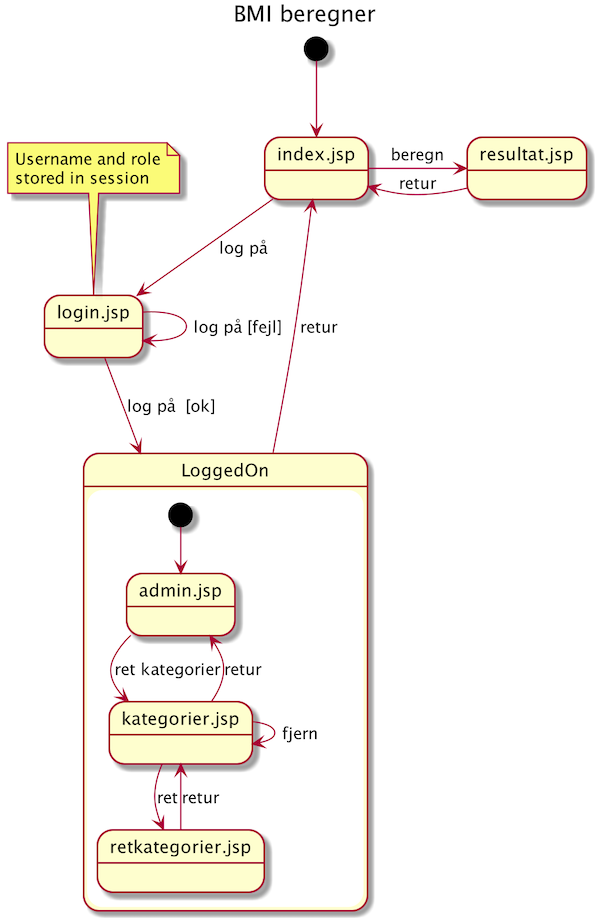
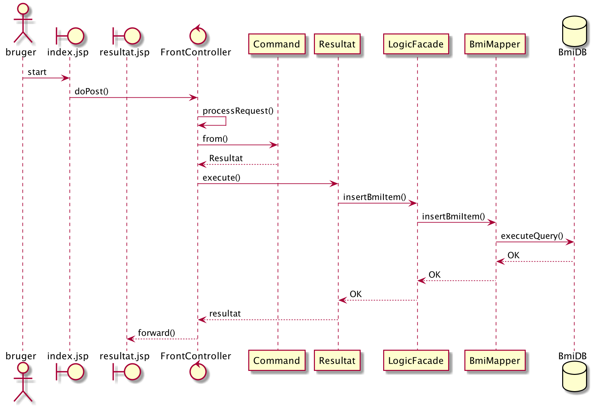

# Rapportskrivning og dokumentation
Det er meningen, at du efter denne uge skal kunne skrive en rapport om dit program.
Formålet med rapporten er, at sætte en anden software udvikler til hurtigt og præcist at sætte sig ind i dit program, sådan at vedkommende kan fejlrette, udvide og ændre med størst mulig sikkerhed.

### Læringsmål
Efter denne uge forventes du at:

* kunne beskrive navigationen mellem web-siderne i dit system ved hjælp af et ***tilstandsdiagram***.
* kunne beskrive dit system ved hjælp af et ***aktivitetsdiagram*** med swim-lanes som viser hvordan bruger og system arbejder sammen/interagerer.
* kunne beskrive hvilke dele af programmet der bliver kaldt, når en bruger laver input på en specifik side ved hjælp af et ***sekvensdiagram***
* kan redegøre for hvilke dele af systemet der er *implementeret* i modsætning til dem der er *planlagt*.
* kan redegøre for hvordan ikke-implementerede elementer skal laves (hvilke klasser, metoder, database tabeller, jsp sider og servlets mangler)
* kunne beskrive hvilken validering af brugernes input der fortages (eller burde foretages)
* kan bruge ***javadoc*** på klasser og metoder

### Erhvervskompetencer
Når man arbejder professionelt kommer man løbende til at skifte projekt. Man kommer derfor til at overtage andres kode, og man kommer til at videregive sin kode til andre. Det er derfor vigtigt, at du kan dokumentere din kode internt vha javadoc, at beskrive nuværende implementationsstatus, og at du kender til de standarder, der er for dokumentation af software (diagrammer).

## Ugeplan

Dag | Emne
---|---
Tirsdag | 09.00 - 11.00 Online undervisning (Jon)
Onsdag | Selvstændigt arbejde
Torsdag | 09.00 - 11.00 Online undervisning
Fredag |  Selvstændigt arbejde

### Materiale til ugen
* [UML at Tutorialspoint](https://www.tutorialspoint.com/uml/). Der er både en oversigts beskrivelse af formålet med UML, og en kort forklaring på hver type af diagram.
* [Diagrammer med PlantUML](Diagrammer.md)
* [Javadoc](javadoc.md), and [Javadoc in IntelliJ](javadocIntelliJ.md)
* [Skabelon for en rapport](RapportSkabelon.md)
* [Slides](Diagrams.pptx)

### Tirsdag

#### Navigationsdiagram

```plantuml
@startuml

Title BMI beregner

state index.jsp
state login.jsp

note top of login.jsp
Username and role
stored in session
end note

[*] --> index.jsp
index.jsp -right-> resultat.jsp: beregn
resultat.jsp -left-> index.jsp: retur
index.jsp --> login.jsp: log på
login.jsp --> LoggedOn: log på  [ok]
login.jsp --> login.jsp: log på [fejl]

state LoggedOn {
    state admin.jsp
    state resultat.jsp
    state kategorier.jsp
    state retkategorier.jsp
    [*]-->admin.jsp
    admin.jsp --> kategorier.jsp: ret kategorier
    kategorier.jsp --> admin.jsp: retur
    kategorier.jsp --> retkategorier.jsp: ret
    retkategorier.jsp --> kategorier.jsp: retur
    kategorier.jsp --> kategorier.jsp: fjern
    LoggedOn --> index.jsp: retur
}
@enduml
```

#### Sekvensdiagram

```plantuml
@startuml

autonumber
Title Beregning af BMI
actor bruger

boundary index.jsp
boundary resultat.jsp

bruger -> index.jsp: start
== Initialization ==
box BmiUtil
index.jsp -> Initializer: getSportList()
Initializer --> index.jsp: ArrayList<Sport>
end box
== Beregn BMI ==
box PresentationLayer
control FrontController
index.jsp -> FrontController: doPost()
FrontController -> FrontController: processRequest()
FrontController -> Command: from()
Command --> FrontController: Resultat
FrontController -> Resultat: execute()
end box

box LogicFacade
Resultat -> LogicFacade: insertBmiItem()
end box

box DBAccess
LogicFacade -> BmiMapper: insertBmiItem()
end box

database BmiDB
BmiMapper -> BmiDB: executeQuery()
BmiDB --> BmiMapper: OK
BmiMapper --> LogicFacade: OK
LogicFacade --> Resultat: OK
Resultat --> FrontController: resultat
FrontController --> resultat.jsp: forward()

@enduml
```

### Review til torsdag
Til torsdags-review skal alle grupper have færdiggjort følgende diagrammer over jeres løsning til cup-cake:

* EER diagram over hvilke tabeller der er i databasen. Det centrale er hvilke tabeller der er, og hvilke relationer der er mellem disse tabeller samt hvordan de er lavet med fremmednøgler.
* Et navigationsdiagram over hvilke sider I har lavet (eller planlagde at lave), og hvordan man som bruger kommer fra den ene side til den næste.
* Et aktivitetsdiagram over US-1
* Et sekvensdiagram der starter med at en bruger har valgt en cup-cake, og nu vil købe den.

Desuden skal der vises en skabelon for rapporten der er bygget over standard-skabelonen.

## Aflevering af cupcake projekt

* Kildeteksten skal ligge på github, så I kan give et link til jeres kode, så det er nemt at klone.
* Have jeres løsning deployed på Digital Ocean sådan at I kan give et link til jeres program så man kan prøvekøre det.
* Gem rapporten sammen med jeres projekt i pdf-format og push til Github

